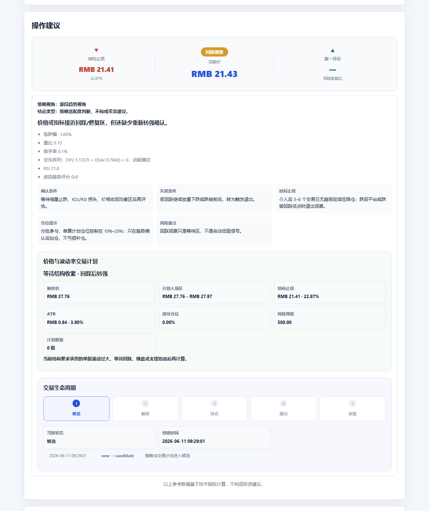

# StockSight-Skill

<a id="readme-zh"></a>

<div align="right">
  <strong>简体中文</strong> · <a href="#readme-en">English</a>
</div>

[](https://github.com/GearVoid/StockSight-Skill/releases/tag/v0.6.0)
[](https://www.python.org/)
[](LICENSE)
[](SKILL.md)

**给 agent 用的股票异动分析技能：抓行情、洗坏数据、接免费公告源、识别风险信号，并按中立、主线、排雷或波段视角生成金融终端感的 Markdown / HTML 报告。**

StockSight-Skill 不是“再写一个行情脚本”。它更像一个小型盘后分析员：先把数据按住，再把异常和硬信息拎出来，最后用清楚、漂亮、可复现的方式交给用户。

> Feed it a ticker. It returns a market brief your agent can actually hand to a human.


## 亮点

- **Agent-ready**：标准 `SKILL.md` 入口，Codex / agent 可以发现、触发、使用。
- **跨市场**：支持 A 股、港股、美股；内置腾讯财经、Yahoo Finance、新浪财经、东方财富 provider，并可选接入 AkShare。
- **异动识别**：检测量比偏离、换手率异常、收益偏离、MACD、RSI 等技术信号。
- **可信度先行**：明显异常字段会显示为 `—`，并标明“可确认 / 推导 / 不可用 / 历史计算”，避免坏数据带偏结论。
- **最终判断区**：详细报告会给出核心结论、主要风险和下一步确认点，让 agent 输出更像分析员而不是表格搬运工。
- **报告口径锁定**：顶部明确行情时间、历史指标截止日期、是否使用 snapshot，减少跨 agent 输出漂移。
- **来源链可见**：报告顶部展示实时行情源、历史行情源、fallback 状态和历史 K 线条数。
- **双输出**：Markdown 适合 agent 直接回复，HTML 适合正式报告和分享。
- **轻量可视化**：风险仪表盘、信号雷达、MACD/RSI/BOLL/KDJ、风险分布、信号构成、数据完整性与可信度面板。
- **硬信息优先**：`--news` 默认先查巨潮资讯和东方财富公告等免费公开公告源；配置 Tavily 或 SerpAPI 后再补市场新闻和舆情。
- **可选策略视角**：默认保持 `neutral` 中立口径，也可显式切到 `mainline`、`risk_avoid`、`swing` 生成不同操作建议视角。
- **可复现快照**：用 snapshot 固定行情、信号、资讯和质量提示，减少不同 agent 之间的自由发挥。
- **最小测试套件**：覆盖 formatter、validator、质量清洗、市场识别、Yahoo provider、snapshot 回放。


## 安装为 Codex Skill

### 方式一：skill 安装器（推荐）

在支持 skill 安装器的 Codex / agent 中：

```text
安装 stocksight skill
```

如果 skill 安装器支持 GitHub URL：

```text
安装 https://github.com/GearVoid/StockSight-Skill.git
```

### 方式二：手动安装

```bash
# 克隆仓库
git clone https://github.com/GearVoid/StockSight-Skill.git

# 安装依赖
cd StockSight-Skill
pip install -r requirements.txt
```

然后把整个仓库目录放进 Codex 的 skills 目录（默认 ~/.codex/skills/），或在 agent 配置中引用该路径。

### 验证安装

```bash
python scripts/report.py --from-snapshot examples/snapshot-sample.json --html --out reports/sample.html
python scripts/screenshot_report.py reports/sample.html --out reports/sample-full.png
```

如果成功生成 `reports/sample.html` 和 `reports/sample-full.png`，说明报告渲染和长截图都可用。无需网络，无需 API key。

### 推荐配置

下载后建议先做两件事：

1. **启用新闻搜索**：`--news` 会先查免费的巨潮资讯和东方财富公告；填好 `.sightconfig.json` 或环境变量后，还能追加 Tavily / SerpAPI 的市场新闻搜索。没有 key 也能生成公告硬信息区。
2. **选择策略视角**：安装或第一次交给 agent 使用时，建议让 agent 问用户默认偏好：`neutral`、`mainline`、`risk_avoid`、`swing`。未指定时保持 `neutral`。
3. **优先分享长截图**：生成 HTML 后用 `scripts/screenshot_report.py` 导出长 PNG，比浏览器打印 PDF 更稳定，也更适合发给人看。

### 其它 Agent（Hermes / Cursor / 通用）

详见 [AGENTS.md](AGENTS.md) — 包含完整的 CLI 调用方式、snapshot 保存与回放、Python API 快速参考。

## 快速开始

安装依赖：

```bash
pip install -r requirements.txt
```

作为 Codex skill 使用：

```bash
git clone https://github.com/GearVoid/StockSight-Skill.git
```

然后把仓库目录放进你的本地 skills 目录，或通过支持 GitHub skill 安装的 agent 直接引用这个仓库。

生成一份 HTML 报告：

```bash
python scripts/report.py 002346 --mode detailed --html --out reports/002346.html
python scripts/screenshot_report.py reports/002346.html --out reports/002346-full.png
```

启用可选策略视角：

```bash
python scripts/report.py 002346 --mode detailed --strategy mainline --html --out reports/002346-mainline.html --markdown-out outputs/002346-mainline.md
python scripts/report.py 002346 --mode detailed --strategy risk_avoid --html --out reports/002346-risk.html --markdown-out outputs/002346-risk.md
python scripts/report.py 002346 --mode detailed --strategy swing --html --out reports/002346-swing.html --markdown-out outputs/002346-swing.md
```

`--strategy` 只改变“操作建议”的策略视角，默认不启用，普通用户继续得到 `neutral` 中立报告口径。
使用 `--strategy mainline` 时，详细报告会额外拆出“主线方向评分”和“Swing 买点评分”：主线层决定这个方向能不能做，swing 层决定这只票当下有没有买点或持有结构。

| Strategy | 视角 | 适合场景 |
|:---|:---|:---|
| `neutral` | 中立默认口径 | 通用报告，不带个人策略偏好 |
| `mainline` | A 股主线第一波中段趋势策略 | 判断当前个股是否适配主线中段试错 |
| `risk_avoid` | 风险排雷视角 | 优先筛 ST/退市、监管、减持、业绩、破位等风险 |
| `swing` | 波段趋势视角 | 看突破、回踩、趋势持有和退出条件 |

### Swing 回测与概率校准

用多个代码生成可复现的历史回测、事件明细和校准文件：

```bash
python scripts/backtest.py 002346 600570 300750 \
  --days 800 \
  --out outputs/backtests/swing-backtest.md \
  --calibration-out outputs/backtests/swing-calibration.json \
  --trades-out outputs/backtests/swing-observations.csv
```

代码较多时可使用 `--codes-file watchlist.txt`。历史数据默认缓存到 `backtest-cache/`；使用 `--refresh` 强制更新。

把校准结果加载进实时 Swing 报告：

```bash
python scripts/report.py 002346 \
  --mode detailed \
  --strategy swing \
  --calibration-file outputs/backtests/swing-calibration.json \
  --html \
  --out reports/002346-swing.html
```

回测口径固定为：收盘形成信号、次交易日开盘进入、仅记录策略状态首次切换，主要观察 10 个交易日净收益，同时统计 5 日和 20 日结果。默认扣除 10 bps 往返成本，可用 `--cost-bps` 修改。历史量比按“当日成交量 / 前 5 日平均成交量”重建，不等同于盘中供应商量比。校准使用按时间顺序切分的样本外验证，并输出 Brier Score、基准 Brier、Brier Skill、ECE、动作/评分分组胜率、平均收益、MFE 和 MAE。

### 价格与波动率交易计划

详细报告会使用 ATR(14)、近期结构低点、近 20 日阻力和账户风险预算生成触发价、入场区、结构止损、两档目标及建议仓位：

```bash
python scripts/report.py 002346 \
  --mode detailed \
  --strategy swing \
  --account-size 100000 \
  --risk-per-trade 0.5 \
  --max-position 20 \
  --atr-period 14 \
  --max-stop-percent 8 \
  --html \
  --out reports/002346-plan.html
```

默认单笔最大账户风险为 `0.5%`，单票仓位上限为 `20%`。A 股数量按 100 股整手向下取整。若结构止损距离超过 `8%`、当前价已经越过计划入场区、策略处于退出/降温/风险规避状态，计划会自动变成等待或零新仓位，不会为了给出数字而强行计算买入量。

### 候选到复盘的状态闭环

使用独立生命周期账本持续跟踪同一只股票和策略视角。价格进入计划入场区时，系统会自动从“候选”推进到“已触发”；实际持仓必须通过成交价确认：

```bash
# 创建候选并按实时高低价自动检查触发
python scripts/report.py 002346 --mode detailed --strategy swing \
  --account-size 100000 --lifecycle-file portfolios/trades.json \
  --html --out reports/002346-live.html

# 确认实际成交，进入持仓
python scripts/report.py 002346 --mode detailed --strategy swing \
  --lifecycle-file portfolios/trades.json \
  --fill-price 16.82 --fill-shares 500

# 手工确认退出；止损、第二目标或策略失效也可自动推进退出
python scripts/report.py 002346 --mode detailed --strategy swing \
  --lifecycle-file portfolios/trades.json \
  --exit-price 18.36 --exit-reason "达到计划目标"

# 退出后封存复盘
python scripts/report.py 002346 --mode detailed --strategy swing \
  --lifecycle-file portfolios/trades.json \
  --review-grade B --review-note "方向正确，但首次加仓偏早"
```

账本保存完整迁移记录、计划止损、实际成交、退出原因、收益金额、收益率、R 倍数和持有天数。候选和触发可以自动推进，持仓必须有实际成交确认，避免把观察信号冒充交易。Snapshot 回放只读取生命周期视图，不允许改写真实账本。



扫描 A 股行业/概念主线雷达：

```bash
python scripts/mainline_radar.py --board all --limit 30 --out outputs/mainline-radar/today.md
```

主线雷达只输出“自动雷达分”和“10 项主线评分待确认清单”。自动雷达分用于发现方向；完整 10 项主线评分达到 6 分，才进入观察/候选流程。脚本拿不到的数据会标为待确认，不按 0 分处理。

生成美股报告：

```bash
python scripts/report.py TSLA --provider yahoo --mode detailed --html --out reports/TSLA.html
```

保存可复现快照：

```bash
python scripts/report.py 002346 --provider tencent --mode detailed --save-snapshot snapshots/002346.json --html --out reports/002346.html
```

从快照重新生成同一份报告：

```bash
python scripts/report.py --from-snapshot snapshots/002346.json --html --out reports/002346-replay.html --markdown-out outputs/002346-replay.md
```

无网络试用：

```bash
python scripts/report.py --from-snapshot examples/a-share-detailed.json --html --out reports/sample.html --markdown-out outputs/sample.md
```

批量生成固定视觉样例：

```bash
python scripts/render_examples.py
```

这会把 `examples/` 中的 A 股、美股、无技术指标、高风险四个固定 snapshot 渲染到 `reports/examples/` 和 `outputs/examples/`，适合每次改 formatter 后做 HTML 对比。

生成长截图：

```bash
python scripts/screenshot_report.py reports/002346.html --out docs/images/002346-full.png
```

这个脚本会自动寻找本机 Chrome / Edge，用 headless 模式把 HTML 报告截成一张长 PNG。也可以通过 `STOCKSIGHT_BROWSER` 指定浏览器路径。

需要 PDF 时，先生成 HTML，再用你自己的浏览器或系统 PDF 工具导出。项目内部不再维护 PDF 导出脚本，避免不同系统字体导致中文乱码。

## Agent 工作流

1. 获取行情：`TencentDataSource`、`YahooFinanceDataSource`、`SinaDataSource`、`EastMoneyDataSource`，或可选的 `AkShareDataSource`。
2. 清洗行情：`normalize_quote_data(stocks)`。
3. 检测异动：`detect(stocks)` 或 `detect_anomalies(stocks)`。
4. 详细单股报告可计算技术指标：A 股优先用 EastMoney 历史 K 线，并自动回退到 AkShare、Sina/Tencent K 线；美股用 Yahoo history，输出 MACD / RSI / BOLL / KDJ。
5. 可选资讯：`search_configured_news(stocks)` 会先查巨潮资讯、东方财富公告等免费公开硬信息源，再按公告/财报/业绩/风险提示 query 模板调用已配置的 Tavily / SerpAPI 搜索兜底。
6. 渲染报告：Markdown 用 `render_standard_report` / `render_detailed_report`，HTML 用 `render_html_report`；详细报告会自动生成最终判断和数据可信度说明。
7. 校验输出：Markdown 用 `validate_report(report_text, data)`。
8. 追求一致性时：优先 `--save-snapshot`，后续一律 `--from-snapshot` 渲染；报告顶部会标明 snapshot 来源和指标截止日期。
9. 需要分享给用户时：优先对 HTML 使用 `scripts/screenshot_report.py` 生成长截图；PDF 交给用户本机浏览器处理。
10. 需要展示策略历史表现时：先用 `scripts/backtest.py` 对多代码样本生成校准 JSON，再通过 `--calibration-file` 加载；不要用单只股票或少量样本宣称策略有效。
11. 需要具体执行计划时：传入 `--account-size`；系统按 ATR、结构止损和风险预算计算仓位，而不是沿用固定百分比止损。
12. 需要持续跟踪一笔交易时：传入 `--lifecycle-file`；只有真实成交才使用 `--fill-price`，退出后再用 `--review-note` 封存复盘。

### 风险口径

StockSight 把“异动强度”和“风险等级”分开处理。A 股上涨涨停默认是强异动/警告，不直接等于危险；只有叠加极端量比、高换手、跌停、顶背离或其他明显转弱证据时才进入危险级。风险分数只用于技术观察，不构成投资建议。

## Python API

```python
from core import ReportData, detect, normalize_quote_data
from core import analyze_technical_indicators, compute_macd, compute_rsi
from formatter import (
    render_standard_report,
    render_detailed_report,
    render_html_report,
    validate_report,
)
from providers import TencentDataSource, YahooFinanceDataSource
```

稳定接口：

- `DataSourceFactory.fetch`
- `detect` / `detect_anomalies`
- `compute_macd(history)` / `compute_rsi(history)`
- `analyze_technical_indicators(history)`
- `render_standard_report(data)`
- `render_detailed_report(data)`
- `render_html_report(data, mode="detailed")`
- `validate_report(report_text, data)`

## 配置

资讯是可选能力。没有 API key 时，StockSight-Skill 仍会尝试通过免费的巨潮资讯和东方财富公告源获取 A 股公告硬信息；Tavily / SerpAPI 只用于补充更宽的市场新闻和舆情搜索。

建议给 agent 配置 Tavily 或 SerpAPI，但它们不是必需。`--news` 会先用免费公告源补公告、财报、业绩预告、风险提示等硬信息；配置搜索 API 后，报告还能补充产业催化、媒体报道和市场舆情。

启用资讯后，报告会分成“公司公告与硬信息”和“市场资讯与舆情”。当前版本优先直连免费公开公告源，再通过 Tavily / SerpAPI 执行更严格的 A 股 query 模板，并给结果打上公告、财报、业绩预告、风险提示等标签。巨潮资讯、东方财富公告、交易所、公司官网等来源会优先展示；普通新闻只作为兜底背景。

参考 `config.example.json` 创建 `.sightconfig.json`：

```json
{
  "stock_sight": {
    "news_provider": "tavily",
    "tavily": {
      "api_key": "tvly-xxx"
    },
    "serpapi": {
      "api_key": "serpapi-xxx"
    }
  }
}
```

也可以使用环境变量：

- `TAVILY_API_KEY`
- `SERPAPI_API_KEY`

## 测试

```bash
python -m unittest discover -s tests -v
```

当前最小测试套件覆盖：

- Markdown / HTML formatter
- 报告 validator
- 数据质量清洗
- MACD / RSI / BOLL / KDJ 技术指标
- detector 对不可用字段的处理
- 市场识别 helper
- Yahoo Finance 美股 provider
- snapshot 保存与回放

## 目录结构

```text
StockSight-Skill/
|-- SKILL.md
|-- core/
|-- formatter/
|-- news/
|-- providers/
|-- scripts/
|-- tests/
|-- references/
|-- examples/
|-- docs/images/
|-- .github/ISSUE_TEMPLATE/
|-- config.example.json
|-- CHANGELOG.md
|-- CONTRIBUTING.md
|-- LICENSE
`-- requirements.txt
```

## 相关文档

- [AGENTS.md](AGENTS.md) — 供 Hermes / Cursor / 通用 agent 使用的完整调用指南
- [RELEASE.md](RELEASE.md) — 版本发布流程与检查清单
- [CHANGELOG.md](CHANGELOG.md) — 版本变更记录
- [CONTRIBUTING.md](CONTRIBUTING.md) — 开发贡献指南

## 注意

报告中的风险等级、目标价、止损参考和操作建议只基于技术指标与公开信息整理，不构成投资建议。

---

<a id="readme-en"></a>

<div align="right">
  <a href="#readme-zh">简体中文</a> · <strong>English</strong>
</div>

# StockSight-Skill

[](https://github.com/GearVoid/StockSight-Skill/releases/tag/v0.6.0)
[](https://www.python.org/)
[](LICENSE)
[](SKILL.md)

**An agent-ready stock anomaly analysis skill that fetches quotes, cleans suspicious data, detects risk signals, and renders polished Markdown / HTML reports.**

StockSight-Skill is not just another quote script. It behaves like a compact market analyst: data first, signal second, report last.

> Feed it a ticker. It returns a market brief your agent can actually hand to a human.

## Highlights

- **Agent-ready** `SKILL.md` entrypoint.
- **Cross-market** quote support for A-shares, Hong Kong equities, and US tickers.
- Providers for Tencent, Yahoo Finance, Sina, and EastMoney.
- Signal detection for volume ratio, turnover, return, MACD, and RSI anomalies.
- Data credibility labels for confirmed, derived, unavailable, and history-computed fields.
- A final judgment section for detailed reports: stance, primary risk, and the next confirmation point.
- Explicit report context: quote timestamp, technical cutoff date, and snapshot replay status.
- Visible data-source chain: quote provider, historical provider, fallback status, and historical bar count.
- Markdown for direct agent replies, HTML for polished reports.
- Premium report visuals: risk gauge, signal radar, MACD/RSI/BOLL/KDJ, risk distribution, signal composition, and data-quality/credibility panels.
- Hard-information-first context: announcements, filings, earnings previews, and risk notices before generic market news.
- Reproducible snapshots to keep different agents aligned on the same data, signals, news, and quality notes.
- Point-in-time Swing backtests with chronological calibration and live out-of-sample context.
- ATR- and structure-based execution plans with risk-budgeted position sizing.
- A persistent candidate → triggered → holding → exited → reviewed lifecycle with fills, exits, P&L, R multiples, and review notes.
- Minimal test suite for the core rendering and data paths.


## Install as Codex Skill

### Method 1: Skill Installer (recommended)

In a skill-installer-capable Codex or agent:

```text
install the stocksight skill
```

Or with a GitHub URL:

```text
install https://github.com/GearVoid/StockSight-Skill.git
```

### Method 2: Manual Install

```bash
# Clone the repository
git clone https://github.com/GearVoid/StockSight-Skill.git

# Install dependencies
cd StockSight-Skill
pip install -r requirements.txt
```

Then place the repository directory in Codex's skills directory (default ~/.codex/skills/), or configure your agent to reference the path.

### Verify Installation

```bash
python scripts/report.py --from-snapshot examples/snapshot-sample.json --html --out reports/sample.html
python scripts/screenshot_report.py reports/sample.html --out reports/sample-full.png
```

If `reports/sample.html` and `reports/sample-full.png` are generated successfully, report rendering and long screenshots are both working. No network or API key required.

### Recommended Setup

After installation, agents should usually do two things:

1. **Configure news search** with `.sightconfig.json` or environment variables so A-share reports can include announcements, filings, earnings previews, and risk notices. Without a key, StockSight still renders the core report and skips company context.
2. **Prefer long screenshots for sharing**. Generate HTML first, then run `scripts/screenshot_report.py` to export a full-report PNG. This is more stable than built-in PDF export across different systems.

### Other Agents (Hermes / Cursor / General)

See [AGENTS.md](AGENTS.md) for the full CLI invocation guide, snapshot save-and-replay workflow, and Python API quick reference.

## Quick Start

Install dependencies:

```bash
pip install -r requirements.txt
```

Use as a Codex skill:

```bash
git clone https://github.com/GearVoid/StockSight-Skill.git
```

Then place the repository in your local skills directory, or install it through an agent that supports GitHub-hosted skills.

Generate an HTML report:

```bash
python scripts/report.py 002346 --mode detailed --html --out reports/002346.html
python scripts/screenshot_report.py reports/002346.html --out reports/002346-full.png
```

Backtest, calibrate, and load historical context into a live Swing report:

```bash
python scripts/backtest.py 002346 600570 300750 --days 800 \
  --out outputs/backtests/swing-backtest.md \
  --calibration-out outputs/backtests/swing-calibration.json

python scripts/report.py 002346 --mode detailed --strategy swing \
  --calibration-file outputs/backtests/swing-calibration.json \
  --account-size 100000 --html --out reports/002346-swing.html
```

Persist the execution lifecycle:

```bash
python scripts/report.py 002346 --mode detailed --strategy swing \
  --account-size 100000 --lifecycle-file portfolios/trades.json

python scripts/report.py 002346 --mode detailed --strategy swing \
  --lifecycle-file portfolios/trades.json \
  --fill-price 16.82 --fill-shares 500

python scripts/report.py 002346 --mode detailed --strategy swing \
  --lifecycle-file portfolios/trades.json \
  --exit-price 18.36 --exit-reason "target reached"

python scripts/report.py 002346 --mode detailed --strategy swing \
  --lifecycle-file portfolios/trades.json \
  --review-grade B --review-note "correct direction, early add"
```

Candidate and triggered states may advance from the live daily range, but holding always requires an actual fill. Snapshot replay can display the lifecycle without mutating the ledger.

Generate a US equity report:

```bash
python scripts/report.py TSLA --provider yahoo --mode detailed --html --out reports/TSLA.html
```

Save a reproducible snapshot:

```bash
python scripts/report.py 002346 --provider tencent --mode detailed --save-snapshot snapshots/002346.json --html --out reports/002346.html
```

Replay from a snapshot:

```bash
python scripts/report.py --from-snapshot snapshots/002346.json --html --out reports/002346-replay.html --markdown-out outputs/002346-replay.md
```

Try without network access:

```bash
python scripts/report.py --from-snapshot examples/a-share-detailed.json --html --out reports/sample.html --markdown-out outputs/sample.md
```

Render all fixed visual examples:

```bash
python scripts/render_examples.py
```

This renders the A-share, US equity, no-technical-data, and high-risk snapshots from `examples/` into `reports/examples/` and `outputs/examples/` for formatter comparison.

Capture a long screenshot:

```bash
python scripts/screenshot_report.py reports/TSLA.html --out docs/images/TSLA-full.png
```

The script auto-detects local Chrome / Edge and captures a long PNG. Set `STOCKSIGHT_BROWSER` when the browser executable lives in a custom path.

If you need PDF, generate HTML first and export it from your own browser or system PDF tools. The project no longer ships a PDF exporter because system fonts made Chinese output unreliable.

## Agent Pipeline

1. Fetch quotes with `TencentDataSource`, `YahooFinanceDataSource`, `SinaDataSource`, or `EastMoneyDataSource`.
2. Normalize quotes with `normalize_quote_data(stocks)`.
3. Detect anomalies with `detect(stocks)` or `detect_anomalies(stocks)`.
4. For detailed single-stock A-share or US reports, compute MACD / RSI / BOLL / KDJ from provider history. A-share history uses EastMoney first, then Sina/Tencent fallback K-lines.
5. Optionally fetch context with `search_configured_news(stocks)`. StockSight runs announcement, filing, earnings, and risk-notice queries first, ranks exchange/CnInfo/Eastmoney/company sources ahead of generic news, then uses market news as fallback.
6. Render Markdown or HTML; detailed reports automatically include a final judgment and data credibility summary.
7. Validate Markdown with `validate_report(report_text, data)`.
8. When consistency matters, save a snapshot once and replay from `--from-snapshot`; report headers show the snapshot source and indicator cutoff.

### Risk Model

StockSight separates anomaly strength from risk severity. An A-share limit-up move is treated as a strong anomaly/watch signal by default, not an automatic danger signal; it only escalates to danger when confirmed by extreme volume ratio, high turnover, limit-down pressure, bearish divergence, or other weakening evidence. Risk scores are technical references only and are not investment advice.

## Public API

```python
from core import ReportData, detect, normalize_quote_data
from core import analyze_technical_indicators, compute_macd, compute_rsi
from formatter import (
    render_standard_report,
    render_detailed_report,
    render_html_report,
    validate_report,
)
from providers import TencentDataSource, YahooFinanceDataSource
```

Stable interfaces:

- `DataSourceFactory.fetch`
- `detect` / `detect_anomalies`
- `compute_macd(history)` / `compute_rsi(history)`
- `analyze_technical_indicators(history)`
- `render_standard_report(data)`
- `render_detailed_report(data)`
- `render_html_report(data, mode="detailed")`
- `validate_report(report_text, data)`

## Configuration

News is optional. Without an API key, StockSight-Skill skips the news section and still renders the core market and risk report.

Agents can use `--news` without a paid search key. StockSight first checks free public A-share announcement sources such as CNINFO and EastMoney notices, then uses Tavily or SerpAPI as optional market-news fallback when configured.

When enabled, context is split into "Company Announcements & Hard Information" and "Market News & Sentiment". Free announcement providers are tried first; Tavily / SerpAPI provide broader search results only when configured, while StockSight controls A-share query templates, category labels, dedupe, and source ranking.

Use `config.example.json` as the shape for `.sightconfig.json`:

```json
{
  "stock_sight": {
    "news_provider": "tavily",
    "tavily": {
      "api_key": "tvly-xxx"
    },
    "serpapi": {
      "api_key": "serpapi-xxx"
    }
  }
}
```

Environment variables are also supported:

- `TAVILY_API_KEY`
- `SERPAPI_API_KEY`

## Testing

```bash
python -m unittest discover -s tests -v
```

## Related Docs

- [AGENTS.md](AGENTS.md) — Full invocation guide for Hermes / Cursor / general agents
- [RELEASE.md](RELEASE.md) — Version release process and checklist
- [CHANGELOG.md](CHANGELOG.md) — Version changelog
- [CONTRIBUTING.md](CONTRIBUTING.md) — Contribution guide

## Disclaimer

Risk levels, target prices, stop-loss references, and operation suggestions are technical references only and do not constitute investment advice.
