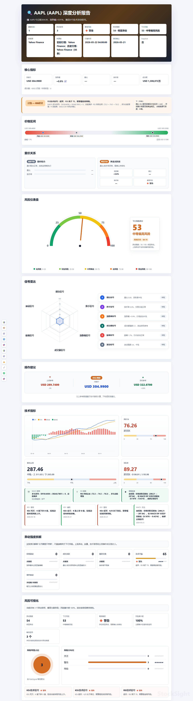

# StockSight-Skill

[](https://github.com/GearVoid/StockSight-Skill/releases/tag/v0.3.0)
[](https://www.python.org/)
[](LICENSE)
[](SKILL.md)

**给 agent 用的股票异动分析技能：抓行情、洗坏数据、识别风险信号，然后生成一份像金融终端快报一样的 Markdown / HTML 报告。**

StockSight-Skill 不是“再写一个行情脚本”。它更像一个小型盘后分析员：先把数据按住，再把异常拎出来，最后用清楚、漂亮、可复现的方式交给用户。

> Feed it a ticker. It returns a market brief your agent can actually hand to a human.



## 亮点

- **Agent-ready**：标准 `SKILL.md` 入口，Codex / agent 可以发现、触发、使用。
- **跨市场**：支持 A 股、港股、美股；内置腾讯财经、Yahoo Finance、新浪财经、东方财富 provider。
- **异动识别**：检测量比偏离、换手率异常、收益偏离、MACD、RSI 等技术信号。
- **可信度先行**：明显异常字段会显示为 `—`，并标明“可确认 / 推导 / 不可用 / 历史计算”，避免坏数据带偏结论。
- **最终判断区**：详细报告会给出核心结论、主要风险和下一步确认点，让 agent 输出更像分析员而不是表格搬运工。
- **报告口径锁定**：顶部明确行情时间、历史指标截止日期、是否使用 snapshot，减少跨 agent 输出漂移。
- **来源链可见**：报告顶部展示实时行情源、历史行情源、fallback 状态和历史 K 线条数。
- **双输出**：Markdown 适合 agent 直接回复，HTML 适合正式报告和分享。
- **轻量可视化**：风险仪表盘、信号雷达、MACD/RSI/BOLL/KDJ、风险分布、信号构成、数据完整性与可信度面板。
- **硬信息优先**：配置 Tavily 或 SerpAPI 后优先检索公告、财报、业绩预告、风险提示，再用市场新闻兜底。
- **可复现快照**：用 snapshot 固定行情、信号、资讯和质量提示，减少不同 agent 之间的自由发挥。
- **最小测试套件**：覆盖 formatter、validator、质量清洗、市场识别、Yahoo provider、snapshot 回放。


## 安装为 Codex Skill

### 方式一：skill 安装器（推荐）

在支持 skill 安装器的 Codex / agent 中：

```text
安装 stocksight skill
```

如果 skill 安装器支持 GitHub URL：

```text
安装 https://github.com/GearVoid/StockSight-Skill.git
```

### 方式二：手动安装

```bash
# 克隆仓库
git clone https://github.com/GearVoid/StockSight-Skill.git

# 安装依赖
cd StockSight-Skill
pip install -r requirements.txt
```

然后把整个仓库目录放进 Codex 的 skills 目录（默认 ~/.codex/skills/），或在 agent 配置中引用该路径。

### 验证安装

```bash
python scripts/report.py --from-snapshot examples/snapshot-sample.json --html --out reports/sample.html
```

如果成功生成 `reports/sample.html`，说明安装正常。无需网络，无需 API key。

### 其它 Agent（Hermes / Cursor / 通用）

详见 [AGENTS.md](AGENTS.md) — 包含完整的 CLI 调用方式、snapshot 保存与回放、Python API 快速参考。

## 快速开始

安装依赖：

```bash
pip install -r requirements.txt
```

作为 Codex skill 使用：

```bash
git clone https://github.com/GearVoid/StockSight-Skill.git
```

然后把仓库目录放进你的本地 skills 目录，或通过支持 GitHub skill 安装的 agent 直接引用这个仓库。

生成一份 HTML 报告：

```bash
python scripts/report.py 002346 --mode detailed --html --out reports/002346.html
```

生成美股报告：

```bash
python scripts/report.py TSLA --provider yahoo --mode detailed --html --out reports/TSLA.html
```

保存可复现快照：

```bash
python scripts/report.py 002346 --provider tencent --mode detailed --save-snapshot snapshots/002346.json --html --out reports/002346.html
```

从快照重新生成同一份报告：

```bash
python scripts/report.py --from-snapshot snapshots/002346.json --html --out reports/002346-replay.html --markdown-out outputs/002346-replay.md
```

无网络试用：

```bash
python scripts/report.py --from-snapshot examples/a-share-detailed.json --html --out reports/sample.html --markdown-out outputs/sample.md
```

批量生成固定视觉样例：

```bash
python scripts/render_examples.py
```

这会把 `examples/` 中的 A 股、美股、无技术指标、高风险四个固定 snapshot 渲染到 `reports/examples/` 和 `outputs/examples/`，适合每次改 formatter 后做 HTML 对比。

需要 PDF 时，先生成 HTML，再用你自己的浏览器或系统 PDF 工具导出。项目内部不再维护 PDF 导出脚本，避免不同系统字体导致中文乱码。

## Agent 工作流

1. 获取行情：`TencentDataSource`、`YahooFinanceDataSource`、`SinaDataSource` 或 `EastMoneyDataSource`。
2. 清洗行情：`normalize_quote_data(stocks)`。
3. 检测异动：`detect(stocks)` 或 `detect_anomalies(stocks)`。
4. 详细单股报告可计算技术指标：A 股优先用 EastMoney 历史 K 线，并自动回退到 Sina/Tencent K 线；美股用 Yahoo history，输出 MACD / RSI / BOLL / KDJ。
5. 可选资讯：`search_configured_news(stocks)` 会先跑公告/财报/业绩/风险提示 query 模板，按交易所、巨潮、东方财富、公司官网等可信源优先排序，再补充市场新闻。
6. 渲染报告：Markdown 用 `render_standard_report` / `render_detailed_report`，HTML 用 `render_html_report`；详细报告会自动生成最终判断和数据可信度说明。
7. 校验输出：Markdown 用 `validate_report(report_text, data)`。
8. 追求一致性时：优先 `--save-snapshot`，后续一律 `--from-snapshot` 渲染；报告顶部会标明 snapshot 来源和指标截止日期。

### 风险口径

StockSight 把“异动强度”和“风险等级”分开处理。A 股上涨涨停默认是强异动/警告，不直接等于危险；只有叠加极端量比、高换手、跌停、顶背离或其他明显转弱证据时才进入危险级。风险分数只用于技术观察，不构成投资建议。

## Python API

```python
from core import ReportData, detect, normalize_quote_data
from core import analyze_technical_indicators, compute_macd, compute_rsi
from formatter import (
    render_standard_report,
    render_detailed_report,
    render_html_report,
    validate_report,
)
from providers import TencentDataSource, YahooFinanceDataSource
```

稳定接口：

- `DataSourceFactory.fetch`
- `detect` / `detect_anomalies`
- `compute_macd(history)` / `compute_rsi(history)`
- `analyze_technical_indicators(history)`
- `render_standard_report(data)`
- `render_detailed_report(data)`
- `render_html_report(data, mode="detailed")`
- `validate_report(report_text, data)`

## 配置

资讯是可选能力。没有 API key 时，StockSight-Skill 会跳过资讯区块，但仍然生成核心行情和风险报告。

启用资讯后，报告会分成“公司公告与硬信息”和“市场资讯与舆情”。当前版本不引入重型公告 SDK，而是通过 Tavily / SerpAPI 执行更严格的 A 股 query 模板，并给结果打上公告、财报、业绩预告、风险提示等标签。交易所、巨潮资讯、东方财富公告、公司官网等来源会优先展示；普通新闻只作为兜底背景。

参考 `config.example.json` 创建 `.sightconfig.json`：

```json
{
  "stock_sight": {
    "news_provider": "tavily",
    "tavily": {
      "api_key": "tvly-xxx"
    },
    "serpapi": {
      "api_key": "serpapi-xxx"
    }
  }
}
```

也可以使用环境变量：

- `TAVILY_API_KEY`
- `SERPAPI_API_KEY`

## 测试

```bash
python -m unittest discover -s tests -v
```

当前最小测试套件覆盖：

- Markdown / HTML formatter
- 报告 validator
- 数据质量清洗
- MACD / RSI / BOLL / KDJ 技术指标
- detector 对不可用字段的处理
- 市场识别 helper
- Yahoo Finance 美股 provider
- snapshot 保存与回放

## 目录结构

```text
StockSight-Skill/
|-- SKILL.md
|-- core/
|-- formatter/
|-- news/
|-- providers/
|-- scripts/
|-- tests/
|-- references/
|-- examples/
|-- docs/images/
|-- .github/ISSUE_TEMPLATE/
|-- config.example.json
|-- CHANGELOG.md
|-- CONTRIBUTING.md
|-- LICENSE
`-- requirements.txt
```

## 相关文档

- [AGENTS.md](AGENTS.md) — 供 Hermes / Cursor / 通用 agent 使用的完整调用指南
- [RELEASE.md](RELEASE.md) — 版本发布流程与检查清单
- [CHANGELOG.md](CHANGELOG.md) — 版本变更记录
- [CONTRIBUTING.md](CONTRIBUTING.md) — 开发贡献指南

## 注意

报告中的风险等级、目标价、止损参考和操作建议只基于技术指标与公开信息整理，不构成投资建议。

---

# StockSight-Skill

[](https://github.com/GearVoid/StockSight-Skill/releases/tag/v0.3.0)
[](https://www.python.org/)
[](LICENSE)
[](SKILL.md)

**An agent-ready stock anomaly analysis skill that fetches quotes, cleans suspicious data, detects risk signals, and renders polished Markdown / HTML reports.**

StockSight-Skill is not just another quote script. It behaves like a compact market analyst: data first, signal second, report last.

> Feed it a ticker. It returns a market brief your agent can actually hand to a human.

## Highlights

- **Agent-ready** `SKILL.md` entrypoint.
- **Cross-market** quote support for A-shares, Hong Kong equities, and US tickers.
- Providers for Tencent, Yahoo Finance, Sina, and EastMoney.
- Signal detection for volume ratio, turnover, return, MACD, and RSI anomalies.
- Data credibility labels for confirmed, derived, unavailable, and history-computed fields.
- A final judgment section for detailed reports: stance, primary risk, and the next confirmation point.
- Explicit report context: quote timestamp, technical cutoff date, and snapshot replay status.
- Visible data-source chain: quote provider, historical provider, fallback status, and historical bar count.
- Markdown for direct agent replies, HTML for polished reports.
- Premium report visuals: risk gauge, signal radar, MACD/RSI/BOLL/KDJ, risk distribution, signal composition, and data-quality/credibility panels.
- Hard-information-first context: announcements, filings, earnings previews, and risk notices before generic market news.
- Reproducible snapshots to keep different agents aligned on the same data, signals, news, and quality notes.
- Minimal test suite for the core rendering and data paths.


## Install as Codex Skill

### Method 1: Skill Installer (recommended)

In a skill-installer-capable Codex or agent:

```text
install the stocksight skill
```

Or with a GitHub URL:

```text
install https://github.com/GearVoid/StockSight-Skill.git
```

### Method 2: Manual Install

```bash
# Clone the repository
git clone https://github.com/GearVoid/StockSight-Skill.git

# Install dependencies
cd StockSight-Skill
pip install -r requirements.txt
```

Then place the repository directory in Codex's skills directory (default ~/.codex/skills/), or configure your agent to reference the path.

### Verify Installation

```bash
python scripts/report.py --from-snapshot examples/snapshot-sample.json --html --out reports/sample.html
```

If `reports/sample.html` is generated successfully, your installation is working. No network or API key required.

### Other Agents (Hermes / Cursor / General)

See [AGENTS.md](AGENTS.md) for the full CLI invocation guide, snapshot save-and-replay workflow, and Python API quick reference.

## Quick Start

Install dependencies:

```bash
pip install -r requirements.txt
```

Use as a Codex skill:

```bash
git clone https://github.com/GearVoid/StockSight-Skill.git
```

Then place the repository in your local skills directory, or install it through an agent that supports GitHub-hosted skills.

Generate an HTML report:

```bash
python scripts/report.py 002346 --mode detailed --html --out reports/002346.html
```

Generate a US equity report:

```bash
python scripts/report.py TSLA --provider yahoo --mode detailed --html --out reports/TSLA.html
```

Save a reproducible snapshot:

```bash
python scripts/report.py 002346 --provider tencent --mode detailed --save-snapshot snapshots/002346.json --html --out reports/002346.html
```

Replay from a snapshot:

```bash
python scripts/report.py --from-snapshot snapshots/002346.json --html --out reports/002346-replay.html --markdown-out outputs/002346-replay.md
```

Try without network access:

```bash
python scripts/report.py --from-snapshot examples/a-share-detailed.json --html --out reports/sample.html --markdown-out outputs/sample.md
```

Render all fixed visual examples:

```bash
python scripts/render_examples.py
```

This renders the A-share, US equity, no-technical-data, and high-risk snapshots from `examples/` into `reports/examples/` and `outputs/examples/` for formatter comparison.

If you need PDF, generate HTML first and export it from your own browser or system PDF tools. The project no longer ships a PDF exporter because system fonts made Chinese output unreliable.

## Agent Pipeline

1. Fetch quotes with `TencentDataSource`, `YahooFinanceDataSource`, `SinaDataSource`, or `EastMoneyDataSource`.
2. Normalize quotes with `normalize_quote_data(stocks)`.
3. Detect anomalies with `detect(stocks)` or `detect_anomalies(stocks)`.
4. For detailed single-stock A-share or US reports, compute MACD / RSI / BOLL / KDJ from provider history. A-share history uses EastMoney first, then Sina/Tencent fallback K-lines.
5. Optionally fetch context with `search_configured_news(stocks)`. StockSight runs announcement, filing, earnings, and risk-notice queries first, ranks exchange/CnInfo/Eastmoney/company sources ahead of generic news, then uses market news as fallback.
6. Render Markdown or HTML; detailed reports automatically include a final judgment and data credibility summary.
7. Validate Markdown with `validate_report(report_text, data)`.
8. When consistency matters, save a snapshot once and replay from `--from-snapshot`; report headers show the snapshot source and indicator cutoff.

### Risk Model

StockSight separates anomaly strength from risk severity. An A-share limit-up move is treated as a strong anomaly/watch signal by default, not an automatic danger signal; it only escalates to danger when confirmed by extreme volume ratio, high turnover, limit-down pressure, bearish divergence, or other weakening evidence. Risk scores are technical references only and are not investment advice.

## Public API

```python
from core import ReportData, detect, normalize_quote_data
from core import analyze_technical_indicators, compute_macd, compute_rsi
from formatter import (
    render_standard_report,
    render_detailed_report,
    render_html_report,
    validate_report,
)
from providers import TencentDataSource, YahooFinanceDataSource
```

Stable interfaces:

- `DataSourceFactory.fetch`
- `detect` / `detect_anomalies`
- `compute_macd(history)` / `compute_rsi(history)`
- `analyze_technical_indicators(history)`
- `render_standard_report(data)`
- `render_detailed_report(data)`
- `render_html_report(data, mode="detailed")`
- `validate_report(report_text, data)`

## Configuration

News is optional. Without an API key, StockSight-Skill skips the news section and still renders the core market and risk report.

When enabled, context is split into "Company Announcements & Hard Information" and "Market News & Sentiment". The current implementation keeps dependencies light: Tavily / SerpAPI provide search results, while StockSight controls A-share query templates, category labels, dedupe, and source ranking.

Use `config.example.json` as the shape for `.sightconfig.json`:

```json
{
  "stock_sight": {
    "news_provider": "tavily",
    "tavily": {
      "api_key": "tvly-xxx"
    },
    "serpapi": {
      "api_key": "serpapi-xxx"
    }
  }
}
```

Environment variables are also supported:

- `TAVILY_API_KEY`
- `SERPAPI_API_KEY`

## Testing

```bash
python -m unittest discover -s tests -v
```

## Related Docs

- [AGENTS.md](AGENTS.md) — Full invocation guide for Hermes / Cursor / general agents
- [RELEASE.md](RELEASE.md) — Version release process and checklist
- [CHANGELOG.md](CHANGELOG.md) — Version changelog
- [CONTRIBUTING.md](CONTRIBUTING.md) — Contribution guide

## Disclaimer

Risk levels, target prices, stop-loss references, and operation suggestions are technical references only and do not constitute investment advice.
