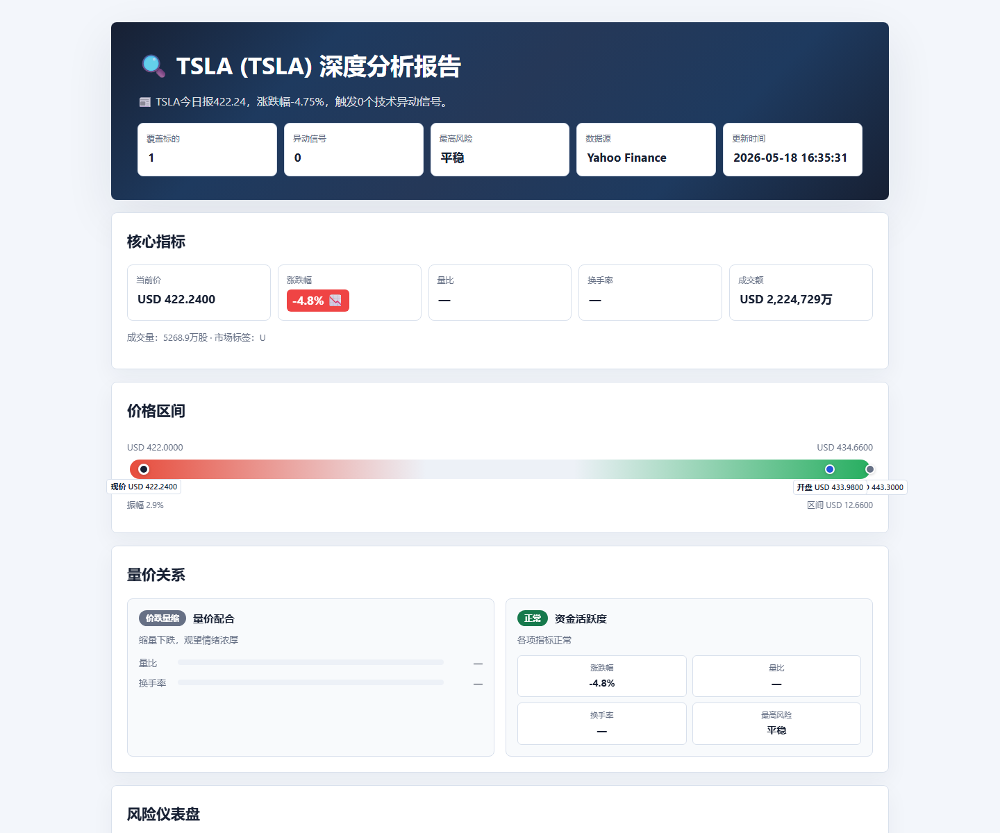
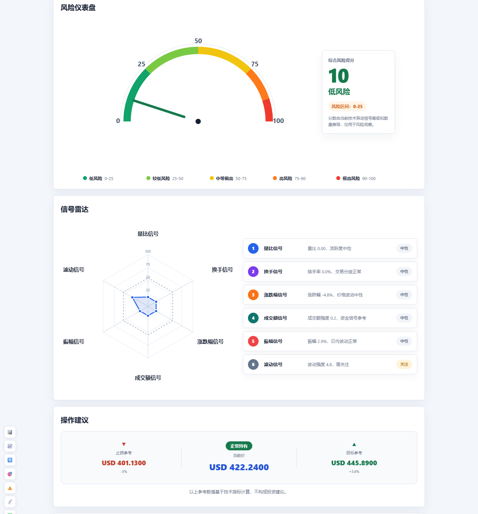
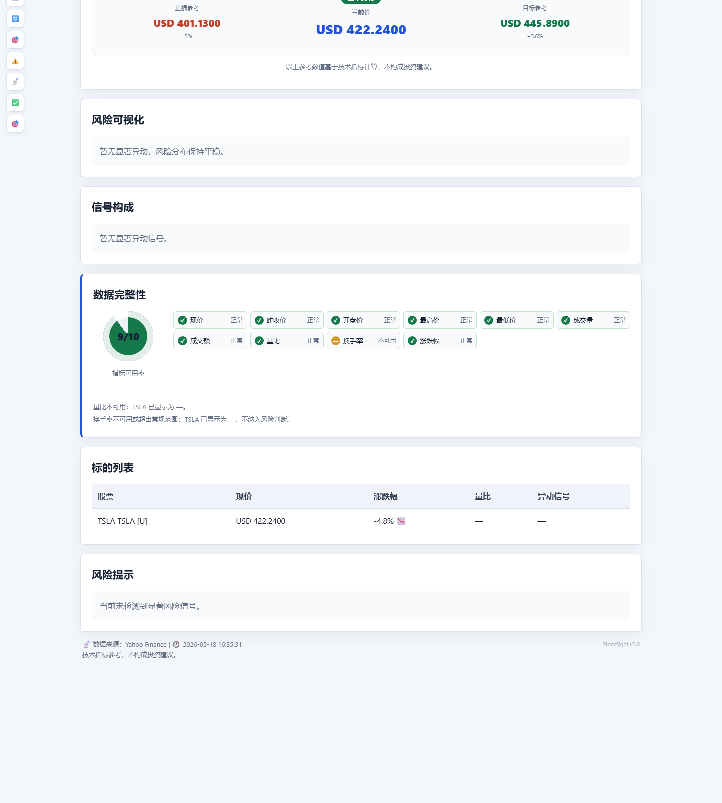

# StockSight-Skill

**给 agent 用的股票异动分析技能：抓行情、洗坏数据、识别风险信号，然后生成一份像金融终端快报一样的 Markdown / HTML 报告。**

StockSight-Skill 不是“再写一个行情脚本”。它更像一个小型盘后分析员：先把数据按住，再把异常拎出来，最后用清楚、漂亮、可复现的方式交给用户。







## 亮点

- **Agent-ready**：标准 `SKILL.md` 入口，Codex / agent 可以发现、触发、使用。
- **跨市场**：支持 A 股、港股、美股；内置腾讯财经、Yahoo Finance、新浪财经、东方财富 provider。
- **异动识别**：检测量比偏离、换手率异常、收益偏离等技术信号。
- **坏数据防误导**：明显异常字段会显示为 `—`，不参与风险判断。
- **双输出**：Markdown 适合 agent 直接回复，HTML 适合正式报告和分享。
- **轻量可视化**：风险仪表盘、信号雷达、风险分布、信号构成、数据完整性面板。
- **可选资讯聚合**：配置 Tavily 或 SerpAPI 后补充公告、财报、异动新闻。
- **可复现快照**：用 snapshot 固定行情、信号、资讯和质量提示，减少不同 agent 之间的自由发挥。
- **最小测试套件**：覆盖 formatter、validator、质量清洗、市场识别、Yahoo provider、snapshot 回放。

## 快速开始

安装依赖：

```bash
pip install -r requirements.txt
```

生成一份 HTML 报告：

```bash
python scripts/report.py 002346 --mode detailed --html --out reports/002346.html
```

生成美股报告：

```bash
python scripts/report.py TSLA --provider yahoo --mode detailed --html --out reports/TSLA.html
```

保存可复现快照：

```bash
python scripts/report.py 002346 --provider tencent --mode detailed --save-snapshot snapshots/002346.json --html --out reports/002346.html
```

从快照重新生成同一份报告：

```bash
python scripts/report.py --from-snapshot snapshots/002346.json --html --out reports/002346-replay.html --markdown-out outputs/002346-replay.md
```

需要 PDF 时，先生成 HTML，再用你自己的浏览器或系统 PDF 工具导出。项目内部不再维护 PDF 导出脚本，避免不同系统字体导致中文乱码。

## Agent 工作流

1. 获取行情：`TencentDataSource`、`YahooFinanceDataSource`、`SinaDataSource` 或 `EastMoneyDataSource`。
2. 清洗行情：`normalize_quote_data(stocks)`。
3. 检测异动：`detect(stocks)` 或 `detect_anomalies(stocks)`。
4. 可选资讯：`search_configured_news(stocks)`。
5. 渲染报告：Markdown 用 `render_standard_report` / `render_detailed_report`，HTML 用 `render_html_report`。
6. 校验输出：Markdown 用 `validate_report(report_text, data)`。
7. 追求一致性时：优先 `--save-snapshot`，后续一律 `--from-snapshot` 渲染。

## Python API

```python
from core import ReportData, detect, normalize_quote_data
from formatter import (
    render_standard_report,
    render_detailed_report,
    render_html_report,
    validate_report,
)
from providers import TencentDataSource, YahooFinanceDataSource
```

稳定接口：

- `DataSourceFactory.fetch`
- `detect` / `detect_anomalies`
- `render_standard_report(data)`
- `render_detailed_report(data)`
- `render_html_report(data, mode="detailed")`
- `validate_report(report_text, data)`

## 配置

资讯是可选能力。没有 API key 时，StockSight-Skill 会跳过资讯区块，但仍然生成核心行情和风险报告。

参考 `config.example.json` 创建 `.sightconfig.json`：

```json
{
  "stock_sight": {
    "news_provider": "tavily",
    "tavily": {
      "api_key": "tvly-xxx"
    },
    "serpapi": {
      "api_key": "serpapi-xxx"
    }
  }
}
```

也可以使用环境变量：

- `TAVILY_API_KEY`
- `SERPAPI_API_KEY`

## 测试

```bash
python -m unittest discover -s tests -v
```

当前最小测试套件覆盖：

- Markdown / HTML formatter
- 报告 validator
- 数据质量清洗
- detector 对不可用字段的处理
- 市场识别 helper
- Yahoo Finance 美股 provider
- snapshot 保存与回放

## 目录结构

```text
StockSight-Skill/
|-- SKILL.md
|-- core/
|-- formatter/
|-- news/
|-- providers/
|-- scripts/
|-- tests/
|-- references/
|-- docs/images/
|-- config.example.json
`-- requirements.txt
```

## 注意

报告中的风险等级、目标价、止损参考和操作建议只基于技术指标与公开信息整理，不构成投资建议。

---

# StockSight-Skill

**An agent-ready stock anomaly analysis skill that fetches quotes, cleans suspicious data, detects risk signals, and renders polished Markdown / HTML reports.**

StockSight-Skill is not just another quote script. It behaves like a compact market analyst: data first, signal second, report last.

## Highlights

- **Agent-ready** `SKILL.md` entrypoint.
- **Cross-market** quote support for A-shares, Hong Kong equities, and US tickers.
- Providers for Tencent, Yahoo Finance, Sina, and EastMoney.
- Signal detection for volume ratio, turnover, and return anomalies.
- Data-quality guardrails so suspicious fields do not create misleading risk signals.
- Markdown for direct agent replies, HTML for polished reports.
- Premium report visuals: risk gauge, signal radar, risk distribution, signal composition, and data-quality panels.
- Optional news aggregation through Tavily or SerpAPI.
- Reproducible snapshots to keep different agents aligned on the same data, signals, news, and quality notes.
- Minimal test suite for the core rendering and data paths.

## Quick Start

Install dependencies:

```bash
pip install -r requirements.txt
```

Generate an HTML report:

```bash
python scripts/report.py 002346 --mode detailed --html --out reports/002346.html
```

Generate a US equity report:

```bash
python scripts/report.py TSLA --provider yahoo --mode detailed --html --out reports/TSLA.html
```

Save a reproducible snapshot:

```bash
python scripts/report.py 002346 --provider tencent --mode detailed --save-snapshot snapshots/002346.json --html --out reports/002346.html
```

Replay from a snapshot:

```bash
python scripts/report.py --from-snapshot snapshots/002346.json --html --out reports/002346-replay.html --markdown-out outputs/002346-replay.md
```

If you need PDF, generate HTML first and export it from your own browser or system PDF tools. The project no longer ships a PDF exporter because system fonts made Chinese output unreliable.

## Agent Pipeline

1. Fetch quotes with `TencentDataSource`, `YahooFinanceDataSource`, `SinaDataSource`, or `EastMoneyDataSource`.
2. Normalize quotes with `normalize_quote_data(stocks)`.
3. Detect anomalies with `detect(stocks)` or `detect_anomalies(stocks)`.
4. Optionally fetch news with `search_configured_news(stocks)`.
5. Render Markdown or HTML.
6. Validate Markdown with `validate_report(report_text, data)`.
7. When consistency matters, save a snapshot once and replay from `--from-snapshot`.

## Public API

```python
from core import ReportData, detect, normalize_quote_data
from formatter import (
    render_standard_report,
    render_detailed_report,
    render_html_report,
    validate_report,
)
from providers import TencentDataSource, YahooFinanceDataSource
```

Stable interfaces:

- `DataSourceFactory.fetch`
- `detect` / `detect_anomalies`
- `render_standard_report(data)`
- `render_detailed_report(data)`
- `render_html_report(data, mode="detailed")`
- `validate_report(report_text, data)`

## Configuration

News is optional. Without an API key, StockSight-Skill skips the news section and still renders the core market and risk report.

Use `config.example.json` as the shape for `.sightconfig.json`:

```json
{
  "stock_sight": {
    "news_provider": "tavily",
    "tavily": {
      "api_key": "tvly-xxx"
    },
    "serpapi": {
      "api_key": "serpapi-xxx"
    }
  }
}
```

Environment variables are also supported:

- `TAVILY_API_KEY`
- `SERPAPI_API_KEY`

## Testing

```bash
python -m unittest discover -s tests -v
```

## Disclaimer

Risk levels, target prices, stop-loss references, and operation suggestions are technical references only and do not constitute investment advice.
